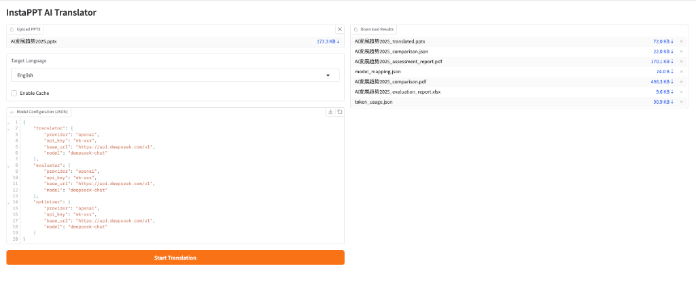
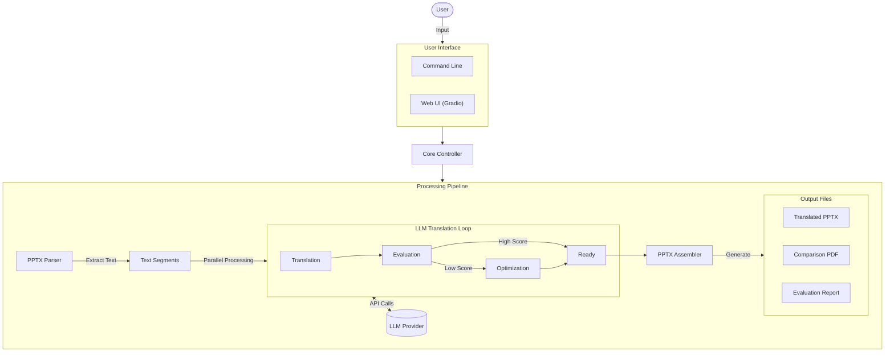

# InstaPPT

**InstaPPT** is an AI-powered PowerPoint translation tool designed to preserve the original visual fidelity of your slides while providing high-quality translations.



## Demo

Here is a visual comparison of the original and translated slides:


[View full comparison PDF](examples/守护地球之肺：森林保护行动_comparison.pdf)

## Features

- **AI Translation:** Uses advanced LLMs (like GPT-4, DeepSeek) for accurate, context-aware translation.
- **Visual Fidelity:** Preserves fonts, colors, sizes, and layout.
- **Visual Comparison Report:** Generates a side-by-side PDF report showing the original and translated slides as images, ensuring "what you see is what you get".
- **Smart Caching:** Caches translation results to save costs and time on repeated runs.
- **Cross-Platform:** Works on macOS (optimized) and Windows.

## Architecture



## Prerequisites

1.  **Python 3.10+**
2.  **LibreOffice:** Required for converting PPTX to PDF.
    -   macOS: `brew install --cask libreoffice`
    -   Windows: Install from official website.
3.  **Poppler:** Required for the image-based visual comparison.
    -   macOS: `brew install poppler`
    -   Windows: Download binary and add to PATH.

## Installation

### Install via Pip

```bash
uv pip install instappt
```

### Development Setup

```bash
# Create virtual environment
uv venv

# Activate virtual environment
source .venv/bin/activate

# Install dependencies
uv sync
```

## Usage

### CLI Usage (After Installation)

If you installed the package via pip, you can use the `instappt` command directly:

```bash
instappt --input input.pptx --output output_dir --lang English --config model_info.json
```

### Development Usage

If you are running from source:

```bash
python main.py --input input.pptx --output output_dir --lang English
```

### Using a Configuration File

Create a `model_info.json` file to configure your LLM settings:

```json
{
    "translator": {
        "model": "gpt-4o",
        "api_key": "sk-...",
        "base_url": "https://api.openai.com/v1"
    }
}
```

Run with config:

```bash
python main.py --input input.pptx --output output_dir --lang English --config model_info.json
```

### Force Re-translation (Disable Cache)

If you want to ignore the cache and force a fresh translation:

```bash
python main.py --input input.pptx --output output_dir --lang English --config model_info.json --no-cache
```

## SDK Usage

You can also use InstaPPT as a Python library in your own projects.

```python
from instappt.core import PPTTranslator
from instappt.models import SDKConfig, ModelConfig

# 1. Configure Models
config = SDKConfig(
    translator_config=ModelConfig(
        model="gpt-4o",
        api_key="sk-...",
        base_url="https://api.openai.com/v1"
    ),
    optimizer_config=ModelConfig(
        model="gpt-4o",
        api_key="sk-...",
        base_url="https://api.openai.com/v1"
    ),
    evaluator_config=ModelConfig(
        model="gpt-4o",
        api_key="sk-...",
        base_url="https://api.openai.com/v1"
    ),
    enable_cache=True # Set to False to disable caching
)

# 2. Initialize Translator
translator = PPTTranslator(config, concurrency=32)

# 3. Process PPTX
input_file = "presentation.pptx"
output_file = "presentation_translated.pptx"
target_language = "English"

translator.process_ppt(input_file, output_file, target_language)

# 4. Generate Reports (Optional)
translator.generate_reports(
    output_dir="output_folder",
    report_prefix="my_report_",
    original_pptx=input_file,
    translated_pptx=output_file
)
```

## Output

The tool generates:
1.  **Translated PPTX:** `[filename]_translated.pptx`
2.  **Visual Comparison:** `[filename]_comparison.pdf` (Side-by-side images)
3.  **Assessment Report:** `[filename]_assessment_report.pdf` (Quality metrics)

## License

This project is licensed under the GNU Affero General Public License v3.0 (AGPL-3.0). See the [LICENSE](LICENSE) file for details.


All files are saved in the specified output directory.
